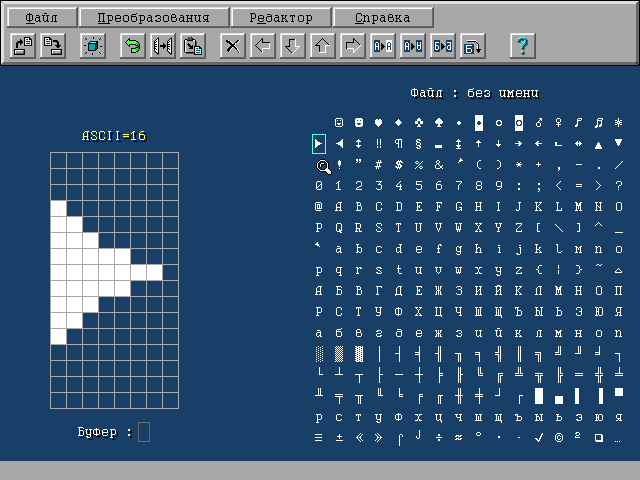

# Font Editor for DOS

Here is my school project written in Turbo Pascal 7.0 in the 90s.

It contains rich editing tools for modifying and creating matrix fonts. It supports 8x8 and 16x8 font sizes. Note that all sources are have the CP866 encoding.

If you want to compile and run this project on the modern hardware then be aware of the [Runtime error 200](https://en.wikipedia.org/wiki/Runtime_error_200).

To build this project you will need Borland Pascal or Turbo Pascal 7. In the IDE you need to change the current directory to the SRC using the "File->Change dir" menu and select the F_STUDIO.PAS as the "Primary file" in the "Compile menu". Also you need to add the path to the OBJ directory in the the "Options->Directories" dialog.

