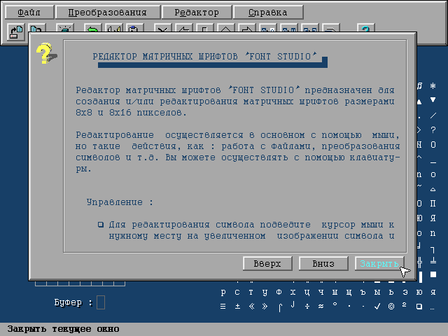
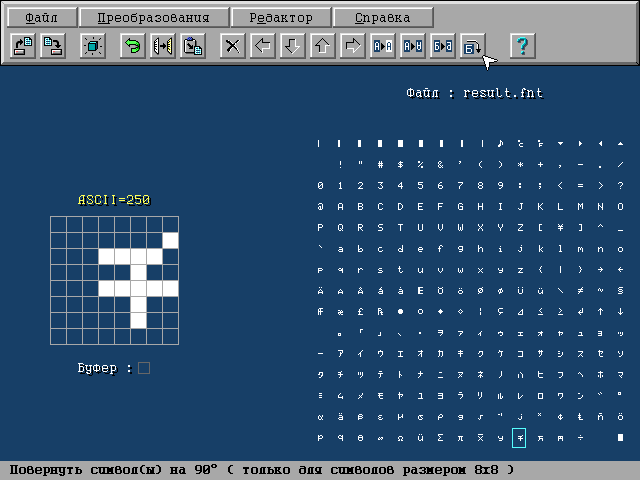

# Font Editor for DOS

Here is my school project written in Turbo Pascal 7.0 in the 90s.

It's contains rich editing tools for modifying and creating matrix fonts. It's supports 8x8 and 16x8 font sizes. Note that all sources are have the CP866 encoding.

If you want to compile and start this project on the modern hardware be aware about the [Runtime error 200](https://en.wikipedia.org/wiki/Runtime_error_200).

To build this project you should use Borland Pascal or Turbo Pascal 7. Change the current dir to SRC using "File->Change dir" menu and select F_STUDIO.PAS as the "Primary file" in the "Compile menu". Also add path to the OBJ directory in the "Options->Directories" dialog.

